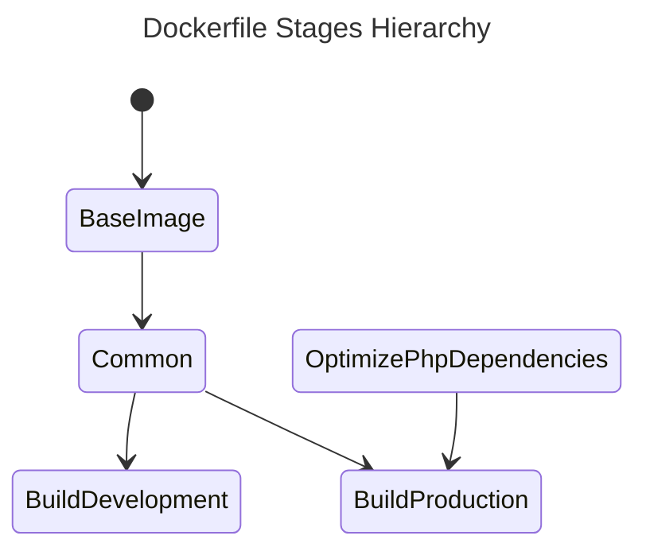

# Laravel Octane + FrankenPHP

> A _dockerized_ environment based on LaravelPHP + Octane and FrankenPHP. 

[TOC]

------

## Summary

This repository contains a _dockerized_ environment for building PHP applications based on **dunglas/frankenphp:php8.4.8-alpine**.

### Highlights

- Unified environment to build <abbr title="Command Line Interface">CLI</abbr>, <u>web applications</u>, and/or <u>micro-services</u> based on **PHP 8**.
- Multi-stage Dockerfile allows you to create optimized **development** or **production-ready** Docker images.
- Uses **FrankenPHP**.
- **Self-signed local domains** thanks to Caddy.

------

## Requirements

To use this repository you need:

- [Docker](https://www.docker.com/) - An open source containerization platform.
- [Git](https://git-scm.com/) - The free and open source distributed version control system.
- [Make](https://www.gnu.org/software/make/) - A command to automate the build/manage process.
- [jq](https://jqlang.github.io/jq/download/) - A lightweight and flexible command-line JSON processor.
- [Gum](https://github.com/charmbracelet/gum) - A tool for glamorous shell scripts.

------

## Built with

| Type           | Component                                                              | Description                                              |
|----------------|------------------------------------------------------------------------|----------------------------------------------------------|
| Infrastructure | [Docker](https://www.docker.com/)                                      | Containerization platform                                |
| Service        | [FrankenPHP](https://frankenphp.dev/)                                  | The Modern PHP App Server, written in Go                 |
| Service        | [Apache Benchmark](https://httpd.apache.org/docs/2.4/programs/ab.html) | A tool for benchmarking HTTP servers                     |
| Application    | [Laravel](https://laravel.com/)                                        | A PHP framework with a robust ecosystem                  |
| Application    | [Octane](https://laravel.com/docs/12.x/octane#main-content)            | Supercharges your application's performance              |
| Miscelaneous   | [Make](https://www.gnu.org/software/make/)                             | Allows to execute commands defined on a _Makefile_       |
| Miscelaneous   | [jq](https://jqlang.github.io/jq/download/)                            | Allows to beautify the Docker inspections in JSON format |
| Miscelaneous   | [Gum](https://github.com/charmbracelet/gum)                            | Improves the *Makefile* with enhanced CLI widgets        |

------

## Getting Started

Just clone the repository into your preferred path:

```bash
$ mkdir -p ~/path/to/my-new-project && cd ~/path/to/my-new-project
$ git clone git@github.com:AlcidesRC/laravel-octane-frankenphp.git .
```

### Conventions

#### Dockerfile

`Dockerfile` is based on [multi-stage builds](https://docs.docker.com/build/building/multi-stage/) in order to simplify the process to generate the **development container image** and the optimized **production-ready container image**.

##### Defined Stages

| Name                        | Description                                                                          |
| --------------------------- |--------------------------------------------------------------------------------------|
| `base-image`                | Used to define the base Docker image                                                 |
| `common`                    | Used to define generic variables: `WORKDIR`, `HEALTCHECK`, etc.                      |
| `build-development`         | Used to build the development environment                                            |
| `optimize-php-dependencies` | Used to optimize the PHP dependencies in production by removing the development ones |
| `build-production`          | Used to build the **production** environment                                         |

###### Defined Stages Hierarchy



#### Project Structure

```text
.
├── ab-endpoints
├── docker
│   ├── ab                                 # Apache Benchmark
│   ├── docker-compose.override.dev.yml    # Docker Compose file for development environment
│   ├── docker-compose.override.prod.yml   # Docker Compose file for production environment
│   ├── docker-compose.yml                 # Base Docker Compose file
│   └── Dockerfile
├── Makefile
├── README-CADDY.md
├── README.md
└── src                                    # PHP application folder
```

##### Volumes

There is a **bind volume** created between the *host* and the container service:

| Host path | Container path | Description            |
| --------- | -------------- | ---------------------- |
| `./src`   | `/app`         | PHP application folder |

> [!NOTE]
>
> Review the `docker-compose.dev.yml` files and adjust the volumes to your convenience.

> [!IMPORTANT]
>
> Remember to rebuild the Docker image if you make any change on `Dockerfile` file.

##### Available Commands

A *Makefile* is provided with following commands:

```bash
~/path/to/my-new-project$ make

╔════════════════════════════════════════════════════════════════════════════════╗
║                                                                                ║
║                            .: AVAILABLE COMMANDS :.                            ║
║                                                                                ║
╚════════════════════════════════════════════════════════════════════════════════╝
🔹 ENVIRONMENT ...  dev 
🔹 DOMAIN URL ....  http://localhost:8000 
🔹 SERVICE(S) ....  app 

Choose a command...         
> exit                      
  set-environment           
  build                     
  up                        
  down                      
  restart                   
  logs                      
  inspect                   
  install-caddy-certificate 
  open-website              
  shell                     
  test-stress
  reload               
                            
←↓↑→ navigate • enter submit
```

#### Web Server

##### Default Domain

The default website domain is https://localhost

##### Certificate Authority (CA) & SSL Certificate

You can generate/register the **Caddy Authority Certificate** in order to get `SSL` support .

> [!NOTE]
>
> Just execute `make install-caddy-certificate` and follow the provided guidelines to generate the Caddy Authority Certificate and install it on your host.

> [!IMPORTANT]
>
> Remember to reinstall the certificate if you rebuild the container service.

#### PHP Application

PHP application must be placed into `src` folder.

### Development

#### Set the environment

This command allows to specify the environment to be working on.

```bash
$ make set-environment
```

```bash
╔════════════════════════════════════════════════════════════════════════════════╗
║                                                                                ║
║                            .: AVAILABLE COMMANDS :.                            ║
║                                                                                ║
╚════════════════════════════════════════════════════════════════════════════════╝
🔹 ENVIRONMENT ...  dev 
🔹 DOMAIN URL ....  http://localhost:8000 
🔹 SERVICE(S) ....  app 

Setting up Makefile environment...
> dev                             
  prod                            
                                  
←↓↑→ navigate • enter submit
```

> [!TIP]
>
> This value is persisted on `.env` file to improve the UX.

#### Building the container

```bash
$ make build
```

#### Starting the container service

```bash
$ make up
```

#### Extracting Caddy Local Authority - 20XX ECC Root 

```bash
$ make install-caddy-certificate
```

#### Accessing to web application

```bash
$ make open-website
```

#### Service logs

```bash
$ make logs
```

#### Inspecting services

```bash
$ make inspect
```

#### Stopping the container service

```bash
$ make down
```

### Production

#### Setup the environment

This command allows to specify the environment to be working on.

```bash
$ make set-environment
```

```bash
╔════════════════════════════════════════════════════════════════════════════════╗
║                                                                                ║
║                            .: AVAILABLE COMMANDS :.                            ║
║                                                                                ║
╚════════════════════════════════════════════════════════════════════════════════╝
🔹 ENVIRONMENT ...  dev 
🔹 DOMAIN URL ....  http://localhost:8000
🔹 SERVICE(S) ....  app 

Setting up Makefile environment...
  dev                             
> prod                            
                                  
←↓↑→ navigate • enter submit
```

> [!TIP]
>
> This value is persisted on `.env` file to improve the UX.

#### Building the container

```bash
$ make build
```

#### Starting the container service

```bash
$ make up
```

#### Extracting Caddy Local Authority - 20XX ECC Root 

```bash
$ make install-caddy-certificate
```

#### Accessing to web application

```bash
$ make open-website
```

#### Service logs

```bash
$ make logs
```

#### Inspecting services

```bash
$ make inspect
```

#### Stopping the container service

```bash
$ make down
```

------

## Security Vulnerabilities

Please review our security policy on how to report security vulnerabilities:

**PLEASE DON'T DISCLOSE SECURITY-RELATED ISSUES PUBLICLY**

### Supported Versions

Only the latest major version receives security fixes.

### Reporting a Vulnerability

If you discover a security vulnerability within this project, please [open an issue here](https://github.com/alcidesrc/laravel-octane-frankenphp/issues). All security vulnerabilities will be promptly addressed.

------

## License

The MIT License (MIT). Please see [LICENSE](./LICENSE) file for more information.
